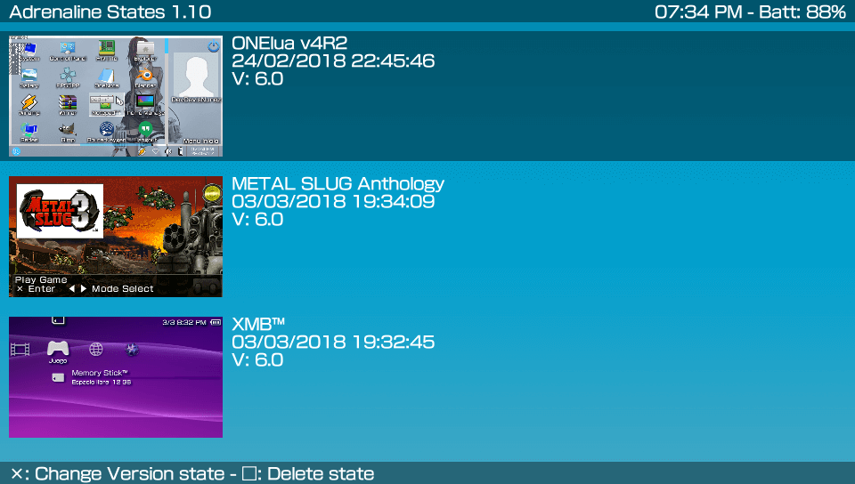

# AdrenalineStates  
Adrenaline States Manager.

AdrenalineStates, is a tool that allows you to update the version or delete the states, its main utility is to allow you to use the states of a previous version in the new adrenaline.

### Warning ###
In a future, if the structure of the states changes, it will no longer be possible to use old states, even updating the version.

### Controls ###
- Up/Down: Browse the list of states
- Cross: Change state version.
- Square: Delete state version.

### Changelog 1.10 ###
- Added support to Adrenaline v6.
- A little refactored the code.
- Updated to the latest version of ONElua.

### Changelog 1.0 ###
- Initial release.
- Added automatic network update. app will now notify you when there's a new update.
- Support get and view complete list of states.
- Support change version of states.
- Support delete states.

### Report bugs ###
if you see something wrong, please submit an issue or pull request.

### Credits ###
- Graphical help as always from my great friend **WZ-(JK)** in [Twitter](https://twitter.com/Mt096Wz).
- **Team Molecule** for HENkaku and taihen.
- All people contributed creating Vita Scene.

### Donation ###
In case you want to support my work on the vita, you can always donate for some coffee. Any amount is highly appreciated:

